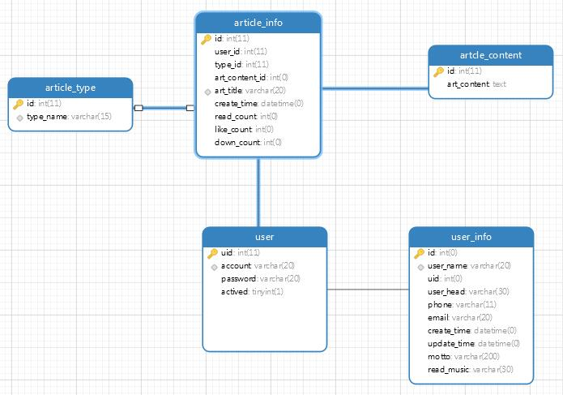

##ZXL的博客开发手册1.0版本(功能简陋版)

****1、Model设计****

[数据库模型ddl](./model/blog.ddl)

[模型解释](./model.md)

ER设计图

****2、使用技术****
        
        1、SpringBoot
        
        2、Mybatis
        
        3、Redis
        
        4、Mysql
        
        5、Thymeleaf
        
        6、BootStrap
        
        7、Makrdown
        
        8、Jenkins

**3、开发原型**(原型还在画)

        1、登录
        
        2、主页面
        
        3、写blog
        
        4、展示....

**4、开发注意事项**
        
        1、尽量使用抽取的基类模板，避免代码冗余
            模板通用措施
            1、api有baseapi，里面包含了最基本的增删改查，和必须的注入，抽取的共用配置，
                所有的baseapi抽取了controllerbase，注入了控制层常用字符串，log等共用代码
                service代码也一样，通过继承的方式来公用方法。
        2、如需修改模型，可以直接修改ddl，但是数据会全部清空
        
        3、所有的容器配置文件(properties,yml) 直接放在目录下面
        
        4、所有的string都统一根据模型放在了strings文件夹下面，不要硬编码
        
        4、所有前端传过来的数据都要在Controller层封装好，所有查询到的数据都要在service或者mapper封装
        好，配置了全局异常处理，所有的异常需要分类抛出，有利于bug的定位
        
**5、包结构及解释**

源代码目录：

        -----com.zxl.blog                                      root目录
        ---------com.zxl.blog.web                              web相关目录
        -------------com.zxl.blog.web.api                      web接口
        -----------------com.zxl.blog.web.api.base             抽取的web基类对象
        -------------com.zxl.blog.web.config                   web相关配置文件
        -------------com.zxl.blog.web.security                 登录安全相关的拦截器
        ---------com.zxl.blog.service                          服务层业务代码
        -------------com.zxl.blog.service.base                 服务层基类
        ---------com.zxl.blog.db                               数据相关对象
        -------------com.zxl.blog.db.pojo                      显示封装bean
        -------------com.zxl.blog.db.mapper                    mapper接口
        -------------com.zxl.blog.db.entities                  实体
        -------------com.zxl.blog.service.base                 服务基类
        ---------com.zxl.blog.acclog                           日志处理类
        ---------com.zxl.blog.exception                        自定义异常
        ---------com.zxl.blog.utils                            工具类包

配置文件目录：

        ------resources                    配置文件主目录配置
        -------------ddl                   数据库ddl文件
        -------------mappers               mybatis映射文件
        -------------strings               字符串文件
        --------------------base           通用字符串文件
        -------------meta                  觉得权限配置
        -------------static                静态资源
        -------------templates             模板文件
              
    
**6、api文档**

[api.md](./api.md)
        

